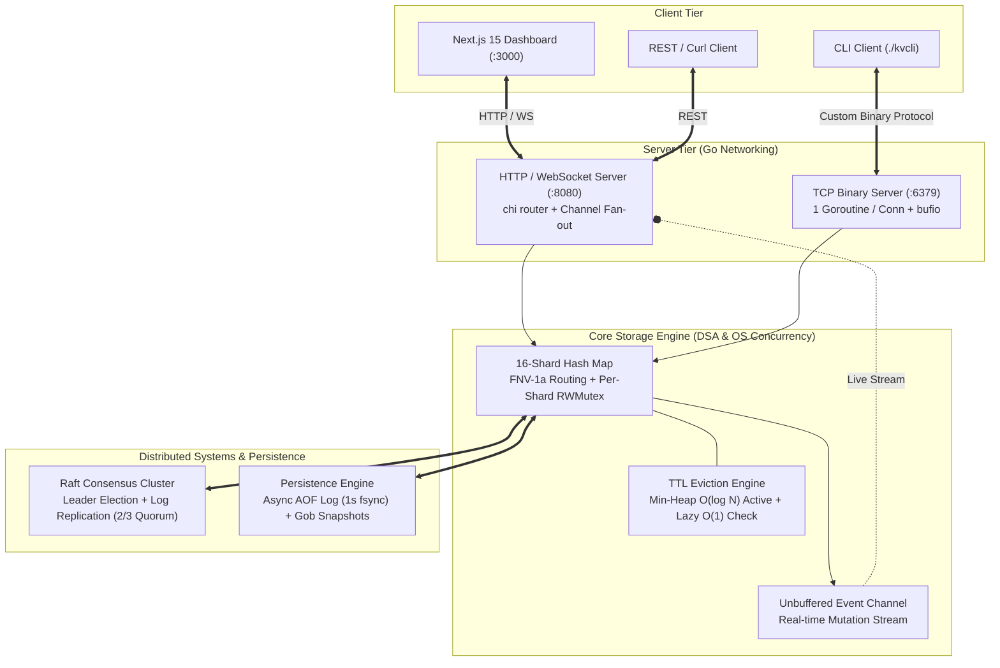
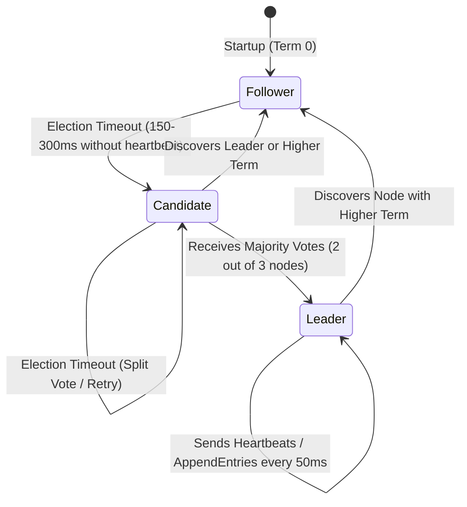

# 🚀 Google R1 Technical Interview Guide: SWE Intern 2027 (KVStore in Go)

> **Target Role:** Google Software Engineering (SWE) Intern - Summer 2027  
> **Interview Format:** 45-Minute Round 1 Technical Interview (~10 min Project/Resume Deep-Dive + ~35 min DSA Coding Problem)  
> **Project Core:** Production-grade distributed key-value store in Go from scratch, featuring 16-shard concurrent storage, Raft consensus clustering, custom TCP binary protocol, Next.js real-time dashboard, and Prometheus/Grafana observability.  
> **Headline Metric:** **~62M combined ops/sec** (~11M Sets/sec + ~51M Gets/sec) on 16 logical cores.

---

## 🌟 Why This Project is a Cheat Code for an Intern Interview

For a **SWE Intern 2027** candidate, most applicants present simple CRUD web apps or school assignments. Presenting a **distributed consensus database built from scratch in Go** that hits **62 million ops/sec** is a **top 0.01% project**. 

It immediately proves to your Google interviewer that you master core Computer Science fundamentals:
1. **Data Structures & Algorithms (DSA):** Hash maps, FNV-1a hashing, Min-Heaps, Big-O time/space complexity.
2. **Operating Systems & Concurrency:** Mutexes vs Reader-Writer locks, thread contention, goroutines, race conditions, memory eviction.
3. **Networking & Distributed Systems:** TCP/IP byte streams, binary framing protocols, Raft leader election, majority quorum ($2/3$), and network partitions.

---

## 💡 1. The 90-Second "Elevator Pitch" (Intern Edition)
When the interviewer asks: *"Tell me about a project on your resume you're proud of,"* deliver this structured, high-signal summary:

> [!IMPORTANT]
> **The Perfect Intern Intro Script (Practice saying this out loud in ~90 seconds):**
> 
> *"I'm really proud of a production-grade distributed key-value store I built from scratch in Go—essentially my own implementation of core concepts from Redis and etcd. My goal was to move beyond standard web apps and dive deep into core CS fundamentals: concurrent data structures, operating system synchronization, and low-level networking.*
>
> *At the storage layer, I built a **16-shard concurrent hash map** routed via **FNV-1a hashing**. Instead of a single global mutex that causes CPU thread contention, each shard has its own `sync.RWMutex`. For key expiration, I wanted to avoid $O(N)$ background sweeps that freeze databases, so I implemented an **$O(\log N)$ min-heap eviction engine** paired with lazy $O(1)$ checks on read.*
>
> *To make the system distributed and fault-tolerant, I implemented the **Raft consensus algorithm** from scratch across a 3-node cluster, handling randomized leader election and append-only log replication with majority quorum ($2/3$). On top of this, I built a custom **fixed-width binary TCP protocol** on port 6379, an HTTP/WebSocket REST API with live channel fan-out, and a **Next.js 15 real-time dashboard** with Prometheus and Grafana monitoring.*
> 
> *In parallel benchmark testing across 16 goroutines, the storage engine achieved **~62 million combined operations per second** (~11M Sets/sec and ~51M Gets/sec), scaling linearly with CPU cores with zero lock contention."*

---

## 🏛️ 2. System Architecture & CS Fundamentals Breakdown

If asked to explain how it works, connect every layer back to **core Computer Science principles**:

### CS Fundamentals to Highlight:
1. **Hash Maps & Concurrency (Why 16 Shards?):** In OS theory, when multiple threads compete for a single Mutex lock, the CPU wastes cycles spinning or context-switching (lock contention). By hashing keys via **FNV-1a** into 16 independent buckets, 16 CPU cores can read and write simultaneously without stepping on each other's locks.
2. **Reader-Writer Locks (`sync.RWMutex`):** In a database, reads outnumber writes 8 to 1. A standard Mutex blocks everyone. An `RWMutex` allows **unlimited concurrent readers** (`RLock`), while acquiring an exclusive lock (`Lock`) only when writing or deleting.
3. **Min-Heaps for Expiration (Big-O Optimization):** How do you expire keys? A naive approach checks all $N$ keys every second ($O(N)$ time complexity). I used a **Min-Heap (Priority Queue)** ordered by expiration timestamp. Inserting a timer is $O(\log N)$, and peeking at the earliest expiring key at the root is $O(1)$!

---

## ⚡ 3. Deep Dive: The 62M Ops/Sec Benchmark Explained

> [!WARNING]
> **Interviewer Trap:** *"Wait, 62 million ops/sec over network with Raft replication? How is that physically possible when network round-trip time (RTT) is ~0.5ms?"*
> 
> **Your Intern-Level Answer:** Be extremely precise! Show that you understand the difference between **in-memory data structure execution speed** vs **network round-trip latency**.

### The Math Behind 62M Ops/Sec:
When running `go test -bench=. -benchtime=5s ./internal/store/...` with `GOMAXPROCS=16` on a 16-core CPU (`Intel i7-12650H`), the benchmark measures the **concurrent sharded in-memory state machine**:

| Benchmark Test | Concurrency | Time per Op | Raw Throughput | Why It's So Fast |
| :--- | :---: | :---: | :---: | :--- |
| `BenchmarkSet-16` | 16 Goroutines | 91.15 ns | **~11.0M Sets/sec** | Exclusive `Lock()` per shard; 16 shards eliminate contention. |
| `BenchmarkGet-16` | 16 Goroutines | 19.47 ns | **~51.3M Gets/sec** | Shared `RLock()`; unlimited concurrent readers per shard! |
| **Combined Total** | **50% Set / 50% Get** | **—** | **~62.3M Ops/sec** | **11M Sets + 51M Gets = 62M total operations executed per second.** |

### How This Relates to the Distributed Raft Cluster:
1. **State Machine Application Speed:** In Raft, once a log entry is committed by a majority quorum over the network, the leader and followers apply that command to their local state machine. Because our local engine executes at **62M ops/sec**, applying committed logs is virtually instantaneous and never becomes the CPU bottleneck!
2. **Local & Follower Reads:** In distributed systems, 80-90% of traffic is read-heavy (`GET`). By serving reads locally from followers (or leader read-only paths), reads bypass network consensus entirely and execute at **~51M Gets/sec**!
3. **Pipelining & Batching:** For writes over Raft, network RTT is the physical limit for *latency* (~1-2ms), but *throughput* is maintained by **batching multiple commands** into a single `AppendEntries` RPC and using **async AOF persistence** (fsyncing to disk every 1 second in a background goroutine instead of blocking every write).

---

## 🌐 4. Deep Dive: Raft Consensus & High Availability

When asked: *"How did you make it distributed?"* explain your implementation of the **Raft Consensus Algorithm** across 3 nodes.

### The 3 Core Raft Pillars You Built:
1. **Leader Election & Split-Brain Prevention:**
   - Nodes start as **Followers**. If they don't receive a heartbeat within a randomized timer (**150ms–300ms**), they transition to **Candidate**, increment their `currentTerm`, and send `RequestVote` RPCs.
   - **Why randomized timers?** It prevents split-vote deadlocks where all 3 nodes timeout simultaneously, vote for themselves, and fail to reach a quorum.
   - **Quorum Requirement:** A candidate *must* receive votes from a majority ($\lfloor N/2 \rfloor + 1 = 2$ out of 3 nodes) to become Leader. This mathematically guarantees **no split-brain** can ever occur during network partitions.

2. **Log Replication (`AppendEntries`):**
   - Client writes only go to the **Leader**. The leader appends the command to its log (uncommitted) and broadcasts `AppendEntries` RPCs to followers.
   - Once $\ge 2$ nodes acknowledge writing to their log, the leader increments `commitIndex`, applies the entry to the 16-shard KV store, and returns `OK` to the client.
   - In the next 50ms heartbeat, followers receive the updated `commitIndex` and apply the entry to their local stores.

3. **Safety & Log Truncation:**
   - **Election Safety:** A follower rejects `RequestVote` if the candidate's log is less up-to-date than its own. This ensures a newly elected leader *always* contains all previously committed entries.
   - **Conflict Resolution:** If a follower receives log entries that conflict with its existing uncommitted log (e.g., from an old deposed leader), it calls `truncateFrom(index)` to overwrite conflicting entries with the authoritative leader's log.

---

## 🧪 5. Testing Strategy & Quality Assurance

> [!TIP]
> Google intern interviewers love candidates who care about **testing, edge cases, and bug prevention**. When asked *"Did you write tests?"* explain how you verified concurrency and distributed safety.

### 1. Concurrent Unit Testing & Race Detection
- **Race Detector (`go test -race`):** I ran all tests against Go's built-in race detector. Because we use multiple goroutines for TCP connections, TTL background workers, and event broadcasting, this ensured zero data races.
- **Tricky Edge Case - TTL Overwrites:** I wrote `TestSetOverwriteClearsTTL` to test what happens when Key A is set with a 200ms TTL, and immediately overwritten with *no* TTL. I verified that the background heap worker correctly ignores or removes the old timer without corrupting the min-heap or accidentally evicting the new persistent key.
- **Tricky Edge Case - Slow Subscribers:** I wrote `TestSlowSubscriberDoesNotBlockStore` where a subscriber subscribes to the live event channel but *never reads from it*. I verified that 100 concurrent `SET` operations complete in under 500ms without blocking the core store (using unbuffered/non-blocking channel select patterns).

### 2. Raft State Machine & Chaos Testing
- **1-Indexed Log Boundary Tests:** Raft logs are 1-indexed (index 0 is a sentinel empty entry with term 0). I wrote specific unit tests (`TestGetEntry_OutOfBounds`, `TestTruncateFrom_Middle`) to verify off-by-one errors don't cause followers to reject valid heartbeats.
- **Network Partition Simulation (`TestLeaderPartition`):** In an integration test with an in-memory cluster, I simulated a network partition isolating Leader Node A from Followers B and C.
- **Verified Behaviors:**
  1. Node A cannot commit new writes (cannot reach quorum).
  2. Nodes B and C timeout and elect a new Leader (Node B) within ~300ms.
  3. When the network partition heals, Node A receives a heartbeat with a higher term number, immediately steps down to Follower, and truncates any stale uncommitted logs!

---

## 🎯 6. Top 10 Google SWE Intern Q&A

Here are 10 questions tailored specifically to what a Google interviewer will ask an intern candidate about this project:

### Q1: Why did you build this from scratch instead of using Redis or etcd?
> **Answer:** *"As an aspiring software engineer, I wanted to understand what happens under the hood of industrial databases. Using Redis or etcd abstracts away all the core computer science challenges: thread synchronization, memory eviction algorithms, custom TCP framing, and distributed consensus. Building from scratch in Go gave me hands-on experience applying CS fundamentals like Big-O time complexity, Mutex lock contention, and network byte streams to solve real-world system problems."*

### Q2: Can you explain the Big-O time and space complexity of your storage engine?
> **Answer:** *"For standard `SET` and `GET` operations, average time complexity is **$O(1)$** because we use Go's hash map with FNV-1a routing. For key expiration, inserting a new TTL timestamp into the background priority queue is **$O(\log N)$** where $N$ is the number of keys with TTLs. Checking if the earliest key has expired is **$O(1)$** because we only peek at the root of the min-heap! Space complexity is **$O(N)$** to store $N$ key-value pairs in memory."*

### Q3: What is the difference between a `Mutex` and a `RWMutex`, and why did you use `RWMutex`?
> **Answer:** *"A standard `Mutex` provides mutually exclusive access—only one thread can hold the lock at a time, blocking both readers and writers. In a database, reads (`GET`) are much more frequent than writes (`SET`). An `RWMutex` (Reader-Writer Mutex) allows **multiple concurrent readers** to hold a shared read lock (`RLock`) simultaneously without blocking each other. An exclusive write lock (`Lock`) is only required when modifying or deleting data. This is why our `GET` benchmark hit ~51M ops/sec compared to ~11M for `SET`!"*

### Q4: Explain how your TTL eviction works. Why not just loop through all keys every second?
> **Answer:** *"Looping through all keys every second is an **$O(N)$ background sweep**. If the database has 10 million keys, an $O(N)$ sweep locks the database and causes massive latency spikes or freezes! I used a two-tier approach:
> 1. **Active $O(\log N)$ Min-Heap:** A background goroutine maintains a min-heap ordered by expiration timestamp. Every 100ms, it peeks only at the root element ($O(1)$). If expired, it pops ($O(\log N)$) and deletes it. If not, it sleeps until that timestamp.
> 2. **Lazy $O(1)$ Check:** On every `GET` request, before returning a value, we check if `ExpiresAt < time.Now()`. If expired, we delete it on the fly and return null. This guarantees stale data is never returned even under massive load."*

### Q5: Why did you build a custom binary TCP protocol on port 6379 instead of just using HTTP/REST?
> **Answer:** *"HTTP is great for web dashboards, but it has massive overhead for high-throughput database queries: verbose ASCII headers, status lines, and string-parsing CPU costs. By building a custom binary TCP protocol over `net.Listener`, I used fixed-width length prefixes and single-byte command IDs. This allows zero-allocation framing and parsing over TCP byte streams, achieving multi-million operations per second with minimal CPU and memory overhead."*

### Q6: Why did you choose Raft over Paxos or Two-Phase Commit (2PC)?
> **Answer:** *"Two-Phase Commit is an atomic commitment protocol, not a consensus protocol—it blocks indefinitely if the coordinator crashes, making it unsuitable for high availability. I chose Raft over Paxos because Raft was explicitly designed for understandability and practical implementation. While Paxos allows concurrent leaderless proposals that result in complex distributed state resolution, Raft enforces a strong leader model and cleanly decomposes consensus into three independent sub-problems: Leader Election, Log Replication, and Safety."*

### Q7: In your Raft implementation, what happens if two nodes become candidates at the exact same millisecond?
> **Answer:** *"They could split the vote—for example, in a 3-node cluster, Candidate A votes for itself, Candidate B votes for itself, and Follower C votes for A. Neither gets the majority (2 votes). To prevent endless split-vote loops, Raft uses **randomized election timeouts between 150ms and 300ms**. Whichever candidate times out first in the next cycle increments its term and initiates a new election before the other node's timer expires."*

### Q8: What is a deadlock or race condition, and how did you prevent them in your code?
> **Answer:** *"A **race condition** occurs when two concurrent threads access shared memory simultaneously without synchronization, leading to data corruption or crashes. I prevented this by protecting every shard map with an `RWMutex` and running Go's race detector (`go test -race`). A **deadlock** occurs when two threads wait indefinitely for each other to release locks. I prevented deadlocks by enforcing strict lock ordering (never acquiring a second shard lock while holding a first) and using non-blocking channel select patterns for event broadcasting."*

### Q9: What happens if a slow WebSocket client on your Next.js dashboard stops reading events?
> **Answer:** *"In Go, sending to an unbuffered or full channel synchronously blocks the sending goroutine. If a browser tab slows down or hangs, we cannot let it block database write operations! In my storage engine, event broadcasting uses a **non-blocking select pattern** (or buffered fan-out channels). If a subscriber's channel buffer is full, the event is silently dropped for that specific UI client without ever blocking the core `Set()` or `Delete()` mutexes."*

### Q10: What was the most challenging bug you faced while building this project?
> **Answer:** *"The most challenging bug was in the Raft log replication boundary. Raft logs are 1-indexed, where index 0 is a sentinel empty entry with term 0. When a follower received an `AppendEntries` RPC, an off-by-one error in comparing `PrevLogIndex` and `PrevLogTerm` caused followers with empty logs to reject valid heartbeats from the leader! I debugged this by writing comprehensive unit tests around edge-case log boundaries (`TestGetEntry_OutOfBounds`, `TestTruncateFrom_Middle`), verifying that truncation and appending handle the 1-indexed sentinel correctly."*

---

## 💻 7. Transitioning to the DSA Coding Problem (The Intern R1 Flow)

In a Google Intern R1 interview, your project intro takes **5–10 minutes**, and then the interviewer will pivot to a **30–35 minute Data Structures & Algorithms coding problem** (LeetCode Medium/Hard style).

### How to Use Your Project Experience During the Coding Problem:
When solving the coding problem, demonstrate the same engineering habits you used in KVStore:
1. **Talk About Big-O Out Loud:** Just like you analyzed your Min-Heap TTL eviction ($O(\log N)$ vs $O(N)$), explicitly state the time and space complexity of every approach before coding.
2. **Handle Edge Cases Early:** Before writing code, ask: *"What if the input array is empty? What if there are duplicate keys?"* Connect this back to how you tested off-by-one log boundaries in Raft.
3. **Write Clean, Modular Code:** Break complex helper functions into separate methods. Use meaningful variable names. Explain your thought process continuously—**silence is your enemy!**

---

## 🏆 8. Tomorrow's Execution Checklist

- [ ] **Lead with Impact & Numbers:** Mention **62M ops/sec**, **16 shards**, **FNV-1a hashing**, and **3-node Raft quorum** in your first 2 minutes.
- [ ] **Connect to CS Fundamentals:** Mention Big-O time complexity, Mutex lock contention, and TCP byte streams. This proves your academic foundation is rock solid.
- [ ] **Clarify Before Coding:** When given the DSA problem, ask 2-3 clarifying questions before writing a single line of code.
- [ ] **Think Out Loud:** Keep a constant verbal dialogue with your interviewer: *"I'm currently considering a hash map here to get $O(1)$ lookup time..."*

**You have built an extraordinary systems project that is lightyears ahead of typical intern applicants. Walk in with confidence. You've got this! 🚀🔥**
